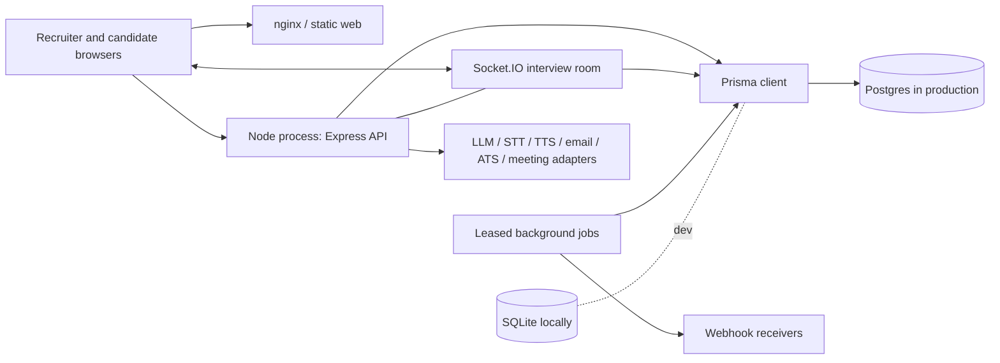
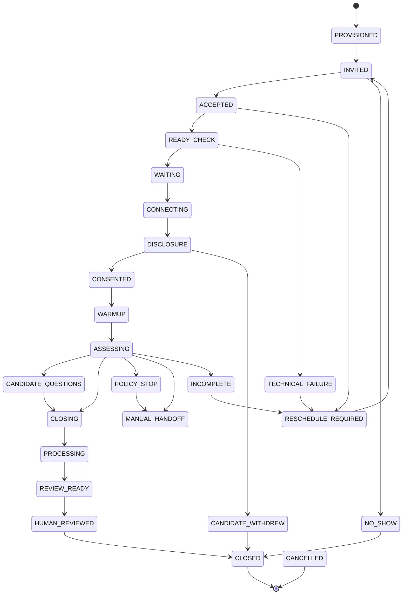

# Questor architecture

Questor is a modular monolith: one web client and one server application. The server process owns the API, live interview sockets, provider adapters, and background jobs.

## Runtime components

Production uses PostgreSQL. Local development defaults to SQLite. The Postgres Prisma schema is generated from the SQLite source schema before Postgres client generation.

## Server shape

- Express REST API: `server/src/routes/*`.
- Socket.IO live interview runtime: `server/src/realtime/*`.
- Interview, evaluation, policy, role, and resume logic: `server/src/engines/*` and `server/src/domain/*`.
- Provider adapters: `server/src/providers/*`.
- Background jobs: `server/src/services/*`, started from `server/src/index.ts`.

`server/src/index.ts` runs preflight, starts retention, incomplete-interview, webhook delivery, and invitation-secret backfill work, creates the Express app, attaches Socket.IO, and listens. Jobs use database leases in `services/jobs.ts` and record `JobRun` rows for `/api/admin/ops`.

### System health

`GET /api/admin/health` (`routes/systemHealth.ts`) is the one request behind the Admin console's System health panel. `services/systemHealth.ts` runs each check in parallel under its own 3-second deadline, so a hung dependency becomes one failed check rather than a request that never answers, and caches the whole report for 15 s per scope. The checks themselves live beside the thing they judge: `systemHealthPlatform.ts` (database, migrations, process, drain, disk, commit, backups), `systemHealthJobs.ts` (every `startJob` name against the interval its own module exports), `systemHealthDelivery.ts` (email, AI provider and failure rate, speech, rate-limit store, retention sweep, webhook v1) and `systemHealthTenant.ts` (one organisation's webhooks, ATS, meeting provider, stuck or failed interviews, feedback drafts, legal holds, resumes).

Scope is the security boundary: deployment-wide checks go only to the operator (`isOperator`, the same rule as the signup queue); every other admin gets their own organisation's checks, filtered by `tenantId`. No check returns a setting's value, an internal address, another organisation's data or an error's text — environment variables are named, never shown, and job notes are redacted before they leave. `BACKUP_DIR` (optional; `/root/Questor/backups` in production) is the only new setting.

## Provider adapters

The zero-key path uses the heuristic LLM, browser speech, hosted interview rooms, generic connectors, and console email. Paid or external adapters are selected by environment. Variable names include `LLM_PROVIDER`, `ANTHROPIC_API_KEY`, `OPENAI_API_KEY`, `STT_PROVIDER`, `DEEPGRAM_API_KEY`, `AZURE_SPEECH_KEY`, `TTS_PROVIDER`, `ELEVENLABS_API_KEY`, `EMAIL_PROVIDER`, `SMTP_HOST`, `SMTP_PORT`, `SMTP_USER`, `SMTP_PASS`, `SENDGRID_API_KEY`, `ATS_PROVIDER`, `ATS_BASE_URL`, `ATS_API_KEY`, `ATS_TENANT_ID` (the ATS variables apply only to that one organisation; every other organisation connects its own ATS in Settings, stored sealed in `AtsConnection`), `MEETING_PROVIDER` (the AI interview room) and `ROUND_MEETING_PROVIDER` (meeting links for human rounds; see docs/CONNECTORS.md).

## Multi-tenancy and authorization

Most business rows carry `tenantId`. Capabilities live in `server/src/domain/capabilities.ts`; object-level checks live in `server/src/services/access.ts`. Access decisions combine tenant, capability, and object scope. Role ownership and candidate ownership are separate because a recruiter can share a role without seeing every candidate under it.

## Interview state machine

The state machine is in `server/src/domain/stateMachine.ts`.

Main states: `PROVISIONED`, `INVITED`, `ACCEPTED`, `READY_CHECK`, `WAITING`, `CONNECTING`, `DISCLOSURE`, `CONSENTED`, `WARMUP`, `ASSESSING`, `CANDIDATE_QUESTIONS`, `CLOSING`, `PROCESSING`, `REVIEW_READY`, `HUMAN_REVIEWED`, `CLOSED`.

Exception states: `RESCHEDULE_REQUIRED`, `NO_SHOW`, `CANDIDATE_WITHDREW`, `TECHNICAL_FAILURE`, `POLICY_STOP`, `MANUAL_HANDOFF`, `CANCELLED`, `INCOMPLETE`.

## Consent, retention, erasure, legal hold

Consent is captured on sessions and controls observation/transcript behavior. Written candidate feedback is sent only after an explicit yes (`CandidateFeedbackOptIn`); no answer on file blocks sending as firmly as a no, and a recruiter can email a never-asked candidate the question (`services/candidateFeedbackOptInRequest.ts`). Retention is session-centered in `services/dataRights.ts` because turns, assessments, artifacts, reviews, feedback, and model executions all belong to the recruitment purpose. Erasure deletes candidate-derived data in dependency order and keeps a non-personal audit record. Legal hold on a session or artifact blocks retention purge and explicit erasure.

The AI observer on human rounds (`services/roundObserver.ts`, `routes/observer.ts`) keeps its own records: `RoundObservation` (both parties' consent, status, evidence quotes) and `ObservationSegment` (transcript chunks, or GAPs where capture failed). Nothing is stored unless both the interviewer and the candidate (via a token link, `/api/observer-consent/:token`) agreed and the observer is LISTENING; the check is a conditional update at write time, so a stop wins over an in-flight upload. Quotes come from `services/observerQuotes.ts`, which keeps only verbatim substrings of one segment filed under a scorecard competency and drops any score, rating, recommendation or summary. Observations are erased with the candidate and purged by the sweep from `endedAt` (`services/observerRetention.ts`); their own `legalHold`, or a hold on the candidate's sessions or artifacts, spares them.

## Trust boundaries and tokens

- Browser to API: cookie auth, CSRF protection, rate limits.
- Candidate portal: invitation token in URL; limiter keys on token where possible.
- API to providers: candidate data may leave the deployment when remote providers are configured.
- API to webhook receivers: signed outbound requests, public URL checks, durable retries.
- Operator shell to database: backups and drills contain candidate personal data.

Invitation tokens are hashed for lookup and sealed for display/resend in `services/invitations.ts`. The seal key is derived from `AUTH_SECRET`, so rotation makes stored sealed links unopenable. Signup-decision tokens and the two post-interview candidate links (talk-to-a-person and feedback opt-in request, one scheme in `services/candidateLinkToken.ts`) are hash-only. Webhooks always carry the timestamped v2 signature. The original v1 header goes only to webhooks with `sendLegacySignature` on (new webhooks default off; rows that predate the column were backfilled on) and to none while `WEBHOOK_V1_SIGNATURE=off`.

## Web client

The React/Vite client lives under `web/src`:

- `pages/*` for route pages.
- `components/*` for shared UI and pure model helpers.
- `api/*` for API client and response modeling.
- Pure model modules include score/status/tour/dashboard/journey/pipeline/system-health helpers and are testable without a browser.
- `components/SystemHealthPanel.tsx` sits at the top of the Admin page, re-checks every 60 s while the tab is visible and cancels its request on unmount; its wording and ordering are in `components/systemHealthModel.ts`.

The interview room uses browser speech in the zero-key path and the server for session state and turns.

## Test strategy

Server tests run on SQLite per worker. Web model tests cover pure client behavior. Simulation scripts exercise interview flows without a browser or paid keys. The e2e suite belongs under `e2e/`; `docs/PENDING.md` says browser smoke coverage is still pending. Deploy health checks are not a replacement for migrations or e2e tests.

## Why not microservices now

Interviews, consent, retention, erasure, audit, and evidence need strong consistency. Splitting now would add distributed transactions, event replay, and cross-service authorization before independent scaling is needed. One process also keeps local setup simple.

## Seams if it ever splits

Likely split points are webhook delivery, retention/erasure, a provider gateway, the realtime interview service, and reporting read models. Before splitting, move rate limiting out of process and replace `prisma db push` with migrations.

## Could not confirm from the repo

- Exact production nginx configuration and backup log paths.
- Actual nightly dump format on the VPS; confirm with `pg_restore --list`.
