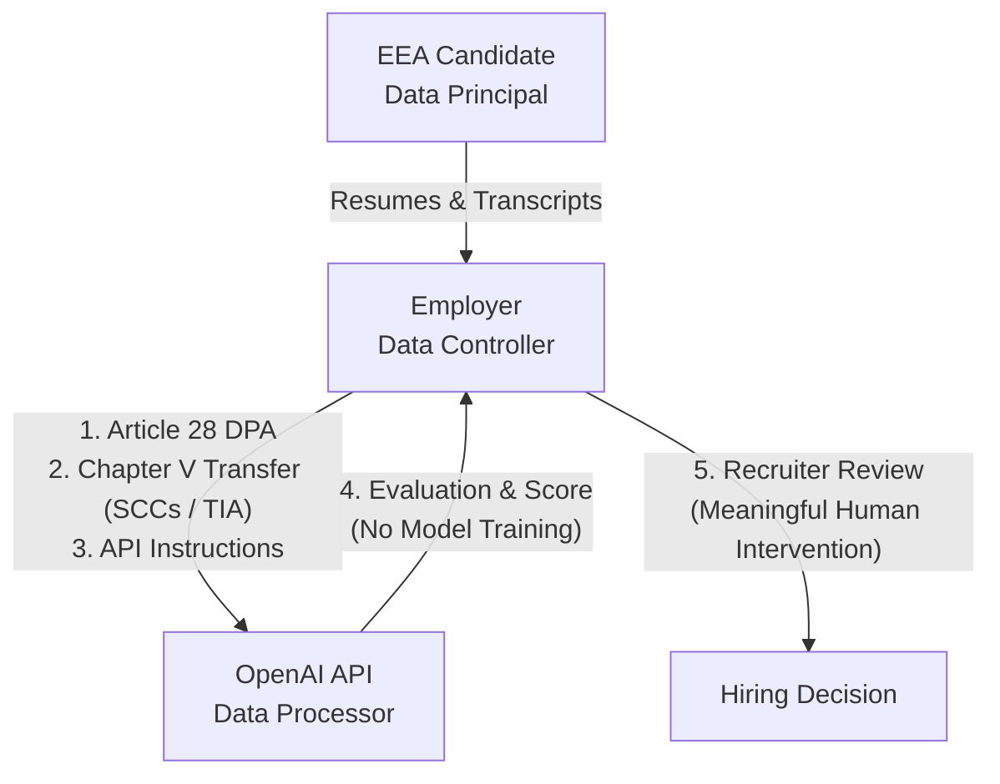

> **NOT LEGAL ADVICE — REVIEW REQUIRED BEFORE USE.**
> This document was drafted by an AI research assistant and has not been reviewed by a
> qualified lawyer. It cites statutes and deadlines that were not independently verified
> and that change frequently. Treat it as a starting checklist for a conversation with
> counsel in each hiring jurisdiction — not as a compliance sign-off. Do not publish or
> send any candidate-facing text from here until a lawyer has approved it.

# Legal & Compliance Report: AI-Powered Recruitment & Candidate Assessment (Mid-2026)

This report provides a comprehensive analysis of the legal and compliance requirements for an employer deploying an AI-powered first-round interview and candidate-assessment tool. In this design, the AI generates an **advisory score**, and a **human recruiter makes the final hiring decision**. The employer recruits globally, targeting candidates in the **United States (specifically New York City and Illinois)**, the **European Union**, and **India**.

---

## 1. EU AI Act

### High-Risk Classification
Under the EU AI Act, AI systems used for employment, worker management, and access to self-employment—specifically those intended to be used for recruitment or selection, notably for advertising vacancies, screening or filtering applications, and evaluating candidates—are classified as **High-Risk AI Systems** under **Annex III, Point 4(a)**.

### Impact of the Advisory-Only Design
* **No Classification Change:** Operating the AI in an "advisory-only" mode **does not** remove it from the High-Risk classification. The Act covers tools used for "screening, filtering, or evaluating" candidates. Because the AI evaluates candidates and generates an advisory score that influences the hiring funnel, it remains High-Risk.
* **Obligation Standard ("Material Influence"):** Under **Article 6**, an AI system is High-Risk if it "materially influences" the decision-making process. Since the advisory score is used by the human recruiter to make the final decision, it exerts material influence. 
* **Oversight Safeguard:** Rather than exempting the tool, the human-in-the-loop design is a **mandatory compliance safeguard** required for all High-Risk AI systems under **Article 14 (Human Oversight)**. The employer must ensure that the human recruiters performing the oversight are trained, can understand the tool's limitations, can detect bias, and have the capability to override the AI's outputs.

### Key Employer (Deployer) Obligations
As a "deployer" of a High-Risk AI system under **Article 26**, the employer must:
1. **Implement Human Oversight (Article 14):** Ensure the tool is designed to allow natural persons to monitor its operation, prevent automation bias (blindly trusting the AI score), and intervene or override recommendations.
2. **Data Governance & Quality (Article 10):** Ensure that validation and testing datasets used by the system are relevant, representative, and free of discriminatory bias.
3. **Automatic Logging (Article 12 & 26(5)):** Keep logs automatically generated by the High-Risk AI system for a period appropriate to its purpose (typically at least six months) to enable forensic auditing.
4. **Transparency & Information (Article 86 & Article 13):** Inform candidates that they are interacting with an AI system. Candidates have a right under **Article 86** to request a clear and reasoned explanation of the AI's role and how the output affected their assessment.
5. **Fundamental Rights Impact Assessment - FRIA (Article 27):** Conduct a detailed impact assessment on how the system affects candidates' fundamental rights (e.g., non-discrimination) prior to deployment.
6. **Consult Worker Representatives (Article 26(7)):** Prior to deploying the system in the workplace, the employer must inform and consult workers' representatives (unions/works councils) where applicable.

### Compliance Deadlines (Post-Digital Omnibus, July 2026)
Following the entry into force of the **Digital Omnibus on AI** in July 2026 (which amended the timeline to address implementation and standards gaps):
* **Annex III High-Risk AI Systems (Recruitment):** The compliance deadline is **December 2, 2027** (extended from the original August 2, 2026 date).
* **General Prohibitions & Ban on Non-Consensual CSAM/Nudification:** Becomes effective on **December 2, 2026**.
* **Transparency (Article 50):** The general requirement to disclose interaction with AI systems applies starting **December 2, 2026** for systems placed on the market before August 2, 2026.

---

## 2. New York City Local Law 144 (LL 144)

### Scope & Triggers
NYC LL 144 regulates the use of **Automated Employment Decision Tools (AEDTs)** in hiring and promotions for positions located in NYC (including remote roles reporting to a NYC office). 

Under the final rules issued by the **NYC Department of Consumer and Worker Protection (DCWP)**, a tool is considered an AEDT if it uses machine learning, AI, or statistical modeling to issue a "simplified output" (score, classification, tag, or recommendation) that is used to **"substantially assist or replace"** discretionary decision-making.

### Impact of the Advisory-Only Design
The advisory nature of the tool is the **decisive factor** for whether LL 144 applies. According to the DCWP rules, "substantially assist or replace" is strictly defined. The law is triggered **only** if the employer:
1. Relies **solely** on the tool’s output to make the decision, with no other factors considered; OR
2. Uses the output as the **sole source of information** for the selection process; OR
3. Weights the tool's output **more heavily than any other criterion** in the decision-making process; OR
4. Uses the tool's output to **overrule human judgment** (e.g., blocking a candidate a recruiter wanted to advance).

> [!IMPORTANT]
> **Advisory-Only Exemption:** If the AI produces an advisory score, but the human recruiter treats it as **one of several factors** without giving it greater weight than other criteria (such as portfolio review, human interview notes, or reference checks) and does not use it to automatically overrule human decisions, the tool **does not** "substantially assist" under the DCWP definition. Consequently, the employer is **exempt** from LL 144's requirements.

### Concrete Obligations (If Triggered)
If the employer does weight the AI score more heavily than other factors, the employer must:
1. **Conduct a Bias Audit:** Arrange for an independent, third-party bias audit of the tool annually. The audit must calculate the impact ratio of the tool across demographic groups (race/ethnicity and sex/gender).
2. **Publish Audit Summary:** Host a summary of the bias audit results, including the date of the audit and the impact ratios, on a publicly accessible section of the company's website.
3. **Notice to Candidates:** Provide written notice to candidates at least **10 business days** before using the tool. The notice must detail that an AEDT is being used, describe the job qualifications the tool assesses, and outline how candidates can request an alternative evaluation process or accommodation.

---

## 3. US State-Level Laws: Illinois AIVIA and Others

### Illinois Artificial Intelligence Video Interview Act (AIVIA) (820 ILCS 42/)
Illinois AIVIA applies directly to any employer who asks job applicants to submit video interviews and uses artificial intelligence to analyze those videos.

### Impact of the Advisory-Only Design
* **No Change in Scope:** The advisory-only status of the tool **does not affect** the applicability of the Illinois AIVIA. 
* **The Trigger:** The sole trigger is using AI to **analyze the video interview** (e.g., analyzing facial expressions, voice modulation, word choice, or body language). Whether the score is advisory or automatically rejects the candidate is irrelevant; the obligations are identical.

### Concrete Obligations under Illinois AIVIA
Before the applicant records and submits the video interview, the employer must:
1. **Written Notice:** Provide written notice to the applicant stating that AI will be used to analyze their video interview.
2. **Written Explanation:** Explain in writing how the AI technology works and the general types of characteristics it uses to evaluate applicants (e.g., "analyses vocal tone and keywords to assess customer service aptitude").
3. **Explicit Consent:** Obtain the applicant's explicit, signed, or electronic consent to be evaluated by the AI. If the applicant refuses, the AI cannot be used.
4. **Limit Distribution (Section 15):** The video interview and any generated data must only be shared with persons whose expertise or technology is necessary to evaluate the candidate.
5. **Mandatory Deletion (Section 20):** Upon a candidate's request, the employer must delete the video interview and all copies/backups within **30 days** of receiving the request, and instruct any third-party vendors (processors) to do the same.

### Similar US State Laws
* **Maryland (Md. Code, Lab. & Empl. § 3-717):** Prohibits employers from using facial recognition services during job interviews without the applicant's prior written consent. Like Illinois, advisory-only status does not exempt the employer.
* **Colorado AI Act (SB 24-205 / CAIA, effective 2026):** Establishes a duty of care for deployers of "high-risk" AI systems, which explicitly includes AI used in employment decisions. Deployers must complete an annual risk-management review, execute a Data Protection Impact Assessment (DPIA), and provide candidates with clear notifications and a description of the tool.

---

## 4. India Digital Personal Data Protection (DPDP) Act, 2023

The India DPDP Act regulates the processing of digital personal data. Job candidates are considered **Data Principals**, and the employer is the **Data Fiduciary**.

### Impact of the Advisory-Only Design
* **No Change in Scope:** The DPDP Act regulates the *processing* of personal data (collection, evaluation, and sharing of candidate resumes and transcripts). The advisory vs. automated decision-making design has no impact on DPDP obligations.

### Concrete Obligations for Candidate Data
1. **Consent vs. Legitimate Use (Section 6 & Section 7):**
   * While Section 7(i) allows processing without consent for "purposes of employment," this exemption is legally understood to apply to existing employees. Because candidates do not have an established employment relationship, relying on Section 7(i) is legally risky. 
   * **Requirement:** Employers should obtain **explicit consent** under **Section 6** during the job application process.
2. **Notice Requirement (Section 5):**
   * Before or at the time of collecting candidate data, the employer must provide a clear notice detailing:
     * The specific personal data being collected (resumes, video transcripts, contact details).
     * The purpose of processing (AI evaluation and recruitment selection).
     * How the candidate can exercise their rights to withdraw consent and file grievances.
     * The contact details of the Data Protection Officer (DPO).
3. **Purpose Limitation (Section 4(1)(b) & Section 6(1)):**
   * Candidate data must only be processed for the specific recruitment cycle for which consent was granted. The employer cannot use the resume to build a database, target internal marketing, or perform other profiling without obtaining fresh consent.
4. **Data Retention / Storage Limitation (Section 8(6) & Section 8(9)):**
   * The employer must delete the candidate's personal data as soon as the purpose of its collection is completed (i.e., when the specific job opening is filled and the recruitment process terminates).
   * For rejected candidates, the data must be erased unless the candidate provides explicit consent to retain their resume for future openings or another law mandates retention.
5. **Data Processor Accountability (Section 8(2)):**
   * The employer (Data Fiduciary) is legally responsible for any data processing carried out on its behalf by a third-party AI provider (Data Processor). The employer must execute a valid contract that binds the processor to identical security and deletion obligations.

---

## 5. EU General Data Protection Regulation (GDPR)

When an employer transmits EEA candidate resumes and interview transcripts to a third-party LLM API provider (e.g., OpenAI API), the employer acts as the **Data Controller**, and the API provider acts as the **Data Processor**.

### Processor Agreements (Article 28)
The employer must execute a written **Data Processing Agreement (DPA)** with the LLM API provider containing all mandatory clauses under **Article 28(3)**:
* **Instruction-Bound Processing:** The processor must process candidate data *only* on documented instructions from the employer.
* **No Secondary Use (Model Training):** The DPA must explicitly state that the provider will not use the candidate's data to train, fine-tune, or improve its LLMs. (OpenAI's standard API terms align with this, but it must be contractually locked in the DPA).
* **Confidentiality & Security:** The provider must ensure its staff are bound by confidentiality and implement appropriate technical and organizational measures (Article 32) to protect the candidate data.
* **Sub-processors:** The provider must obtain written authorization from the employer before engaging sub-processors.

### International Data Transfers (Chapter V, Articles 44-49)
If the LLM provider hosts its servers in the United States, sending candidate data is a restricted international transfer. The employer must establish:
1. **Transfer Mechanism:** Rely on a recognized transfer mechanism. This is typically achieved by integrating the EU-approved **Standard Contractual Clauses (SCCs)** (specifically Module 2: Controller-to-Processor) into the DPA, or relying on the **EU-US Data Privacy Framework (DPF)** if the LLM provider is certified.
2. **Transfer Impact Assessment (TIA):** As mandated by the CJEU *Schrems II* ruling, the employer must document a TIA assessing whether US surveillance laws (e.g., FISA Section 702) compromise the protections of the SCCs, and implement supplementary measures (such as pseudonymous identifiers or encryption-in-transit) if required.

### Automated Decision-Making (Article 22)
Article 22(1) GDPR grants candidates the right not to be subject to a decision based **solely** on automated processing, including profiling, which produces legal or similarly significant effects. 

* **Impact of the Advisory-Only Design:**
  * **Avoiding Article 22:** Because the employer uses an advisory score and a human recruiter makes the final decision, the process is **not "solely" automated**. Therefore, the strict prohibition and the heavy compliance requirements of Article 22 do not apply.
  * **The "Rubber-Stamping" Trap:** If the human recruiter routinely accepts the AI's recommendations without independent critical review, or if the recruiter lacks the time, training, or authority to override the AI score, the process will be deemed "solely automated" in practice. 
  * **Requirements for True Human Oversight:** To legally bypass Article 22, the recruiter's review must be **meaningful**. The recruiter must:
    * Review the candidate's actual resume/transcript, not just the AI score.
    * Have the training to identify AI errors or bias.
    * Have the absolute authority to advance a candidate flagged as "low-match" or reject a candidate flagged as "high-match" by the AI.
  * *If the system lapses into a rubber-stamp model:* The employer must establish a lawful exception under Article 22(2) (typically obtaining the candidate's **explicit consent**) and implement safeguards allowing the candidate to obtain human intervention, express their point of view, and contest the decision.

### Data Subject Erasure Rights (Article 17)
Candidates have the right to request the erasure of their personal data ("Right to be Forgotten"). 
* **Downstream Enforcement:** When a candidate submits an erasure request, the employer must delete all copies of the resume, transcript, and scores.
* **Processor Obligations:** The employer must immediately instruct the LLM provider (as the Data Processor) to delete the candidate's data from its servers and backups. 
* **OpenAI API Specifics:** Under standard API terms, OpenAI retains data for up to **30 days** for abuse and misuse monitoring. The employer must ensure their data retention policy accounts for this 30-day window or negotiate a **Zero Data Retention (ZDR)** configuration if immediate deletion is legally required.

---

## Comparative Executive Summary

The table below outlines how the advisory-only design changes the regulatory burden compared to an automated-rejection design:

| Law | Regulated Action | Does Advisory-Only Design Exempt the Employer? | Actionable Threshold for Employer |
| :--- | :--- | :--- | :--- |
| **EU AI Act** | Screening, filtering, or evaluating job candidates using AI. | **No.** Remains classified as a **High-Risk AI System** (Annex III). | Must implement Article 14 human oversight and comply with Article 26 deployer duties. |
| **NYC Local Law 144** | Using AI to "substantially assist or replace" hiring decisions. | **Yes, conditionally.** | The AI score must be one of several factors, must not be weighted more heavily than others, and must not overrule human decisions. |
| **Illinois AIVIA** | Using AI to analyze video interviews. | **No.** Notice, explanation, and consent are triggered by the analysis itself. | Must obtain written consent and offer deletion rights regardless of the AI's weight. |
| **India DPDP Act** | Processing digital personal data of job candidates. | **No.** Focuses on data processing, not automation level. | Must provide Section 5 notices, obtain Section 6 consent, and erase data after the recruitment cycle. |
| **GDPR (Article 22)** | Solely automated decisions with legal/significant effects. | **Yes, conditionally.** | Recruiter review must be meaningful and active. Rubber-stamping triggers Article 22, requiring explicit consent and contestability rights. |

***

*Disclaimer: This document is for informational and educational purposes only and does not constitute formal legal advice. Organizations deploying AI-driven recruitment tools should consult with legal counsel in each relevant jurisdiction to review specific implementations, vendor DPAs, and compliance policies.*
