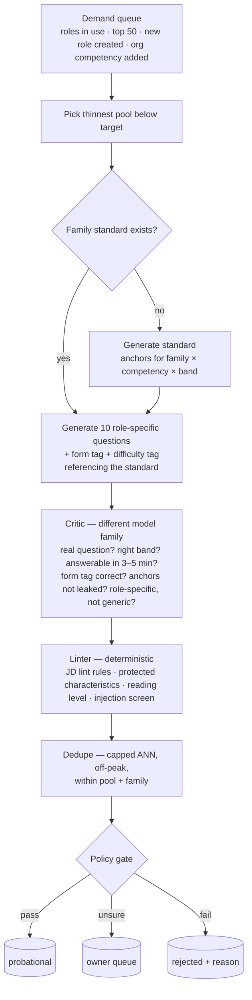

# Questor — Q&A Library: Plan of Action v2

2026-09-20 · Claude Doc: https://claude.ai/code/artifact/b5952b19-a3da-4a49-b04f-6d3250ec133c · supersedes question-answer-library-plan.md (v1 + council review)

## Summary

This is the build plan for the Questor Question & Answer Library, revised after the five-member council review of the first plan (see *Questor — Question & Answer Library Plan*, section “Council review”). The goal is unchanged: a role-specific, experience-specific library that makes every interview meaningful for the actual job, with the interviewer’s real voice keeping it human. What changed is *how* the library touches the conversation, how entries earn the right to be asked, and the arithmetic.

| First plan | v2 (this document) | Why |
| --- | --- | --- |
| Probes chosen by embedding similarity, no model call | Probes are **suggestions**; the engine’s own answer signals pick one, a small model call decides when ambiguous, and the model may write a fresh follow-up | Embedding lookup would feel scripted at the second and third turn of every competency |
| Shadow selection for two weeks | **Interleaved trial**: half the blocks from the library, half from the built-in bank, in the same interview | Shadow picks are never asked, so nothing about them can be measured |
| Approve by policy + 20 random samples a day | **Staged promotion** draft → probational → live, stratified sample | 20 of 2,000 a day is not a gate |
| Pool depth 12, 30-day no-repeat | Depth **derived from expected interview volume** in the window | 12 cannot serve 43 interviews a month |
| Entity-level variety only | **Question-form diversity** carried into the engine’s existing no-repeat window; a **callback turn** every interview | The engine already guards against four STAR questions in a row; the library must not undo it |
| Family-level cost, 3–4k tokens per entry, L0 in 3 days | Recomputed for role-specific fill by demand; L0 = questions + anchors only, 5–6 days | The first numbers were priced for a plan the document no longer proposed |

Everything else from the first plan stands: independent always-on component on the VPS, private-by-default organisation entries with opt-in sharing, the Ollama fallback as a separate track.

## Principles the build must keep

1. **The engine owns the conversation.** Opening, listening, acknowledging, bridging, probing, easing off, answering the candidate’s own question, closing — all stay in `interviewDirector` / `conversationRuntime`. The library supplies *what can be asked* and *what a good answer covers*. It never supplies the next sentence.
2. **Questions + anchors first; everything else earns its place.** L0 ships questions with anchors (checklists of what a strong answer covers). Exemplars, probes, variants and sharing come later, each behind a measured gate.
3. **Nothing is live until it has been asked and measured.** Generation and critique make an entry *probational*; real usage in the sandbox and the interleaved trial makes it *live*.
4. **Measured, not asserted.** Difficulty, fairness, variety and “done” are defined by numbers the system can actually observe (evidence yield, non-answer rate, reviewer agreement, form distribution, score dispersion across sibling entries) — never by a label a model assigned at generation time.
5. **Role-specific questions, shared standards.** Every question is written for the role’s own scorecard and JD wording. Anchors (and later exemplars) are written once per job family × competency × band so two candidates for different roles in the same family are judged to the same standard.
6. **Can never break a live interview.** Feature flag per organisation, built-in bank as automatic fallback on any error or thin pool, worker in its own process at low priority, all migrations additive, kill switch with no data migration either way.
7. **Untrusted text stays untrusted.** Organisation-entered questions and competency definitions are linted and injection-screened at creation, bounded in prompts the same way the JD is today, and never spoken aloud unscreened.

## Data model v2

One aggregate per entry (the council’s JSON recommendation) with explicit version columns (Codex’s versioning requirement). Own migrations, additive only; nothing outside the library writes to these tables.

| Table | Columns that matter | Notes |
| --- | --- | --- |
| `LibraryEntry` | `id`, `scope` (global \| org) + `tenantId?`, `roleSlug`, `familySlug`, `competencyKey`, `band`, `form` (QuestionForm: situation \| task \| decision \| teach-back \| opinion \| work-sample … — reuse the engine’s `QuestionForm`), `questionText`, `bodyJson` (anchors\[\], later probes\[\], exemplars{strong, adequate, weak}, variants\[\]), `status` (draft \| probational \| live \| retired \| rejected), `difficultyTag` 1–3 (critic, cold start only), `difficultyEmpirical?` (computed), `supersedesId?`, `generatorPromptVersion`, `generatorModel`, `criticModel`, `criticVerdictJson`, `policyVersion`, `rubricVersion`, `competencyVersion`, `createdBy` (worker \| user id), timestamps | Anchors live in `bodyJson` for role entries but **reference** a `LibraryStandard` row when one exists for the family |
| `LibraryStandard` | `familySlug`, `competencyKey`, `band`, `anchorsJson`, `exemplarsJson?`, `version`, `status` | The shared standard per job family × competency × band; role entries point at it so scoring is comparable across roles |
| `LibraryUsage` | `entryId`, `interviewSessionId`, `tenantId`, `roleId`, `askedAt`, `outcome` (answered \| non-answer \| skipped), `evidenceYield`, `probeCount`, `reviewerDelta?`, `blockSource` (library \| builtin) | Keyed to the **interview**, not the candidate; erased with the session |
| `LibraryPoolTarget` | `roleSlug`, `competencyKey`, `band`, `depthTarget`, `formMixJson`, `computedFrom` (volume window) | Depth derived from expected interviews in the no-repeat window; recomputed nightly |
| `LibraryReview` | `entryId`, `actor` (policy \| owner \| org user \| trial), `action`, `reason`, `sampleStratum?`, `at` | Every status change |
| `LibraryPolicy` | thresholds, sample size, promotion N, per-org overrides, `version` | Versioned so an entry records which policy approved it |
| `LibraryBudget` | day, callsUsed, callsCap, tokens | Cap in **calls per day**, as `catalogRefreshChunk` does |

**Status lifecycle.** `draft` (generated) → `probational` (passed critic + linter + dedupe under a policy version) → `live` (N clean uses in sandbox or trial) → `retired` (quality loop, owner, complaint, superseded). `rejected` keeps the critic’s reason so the generator sees it on the next batch. Editing creates a new entry with `supersedesId`; the old one is retired, never deleted, so transcripts resolve.

**Competency key.** Entries key on the role catalog’s competency key plus the scorecard’s `competencyVersion`. Organisation-added competencies (the custom-competencies build in flight) get **org-scoped pools** generated on demand from their definition and indicators — private, like everything org-entered.

**Reserved ids.** No entry id may start with `__` (the engine’s non-competency block namespace).

## Generation pipeline v2



**Role-specific questions, family-level standards.** The generator reads the role’s scorecard (name, definition, indicators per competency), the JD wording, the band guidance and the existing entries in the pool, and writes questions that could only be asked for this job. Anchors come from the family standard so scoring stays comparable across roles; where a role’s competency genuinely differs from the family (the critic checks), a role-level standard is created and marked as such.

**Independent critic.** Generator and critic are **different model families** (decision: an Anthropic API key for the critic; GPT-5.6 Sol generates). A second OpenAI model with a different prompt is not accepted as independent. The critic also grades role-fit (“could this question be asked for any job in the family?” → reject) because generic questions are the long-tail failure mode.

**Linter and injection screen.** The existing JD lint and policy-engine checks, plus an injection screen (imperatives addressed to the interviewer, role-play instructions, markup) — applied to generated text *and* to organisation-entered text at creation.

**Dedupe.** Embeddings computed locally, but capped: approximate index, batch during off-peak hours, CPU budget per minute, and never on the request path. The worker runs as its **own pm2 process** at low priority; the deploy script pauses it and resumes after health passes.

**Fill by demand.** Priority order: pools for roles with a scheduled interview and no live entries (urgent, small batches, target under one hour); roles an organisation has created; top 50 roles by volume; then the long tail at reduced depth. A new role or a new org competency enqueues its pools immediately.

**Budgets and resumability.** Daily cap in calls, rolling 30-day cap in tokens, progress saved per batch, lease so two workers never overlap, clean stop and resume across deploys. When the primary model is unavailable the worker pauses; it never fills from a weaker source.

**Prompt and model versions** are stamped on every entry; a new generator prompt version puts its first pools back through the owner queue until a clean stratified sample.

## Approval v2: staged promotion

| Stage | Enters when | Where it can be asked | Leaves when |
| --- | --- | --- | --- |
| **draft** | generated | nowhere | critic + linter + dedupe run |
| **probational** | passes the policy gate under a recorded policy version | demo sandbox; interleaved-trial blocks; never a live-only interview | N clean uses (default 5) with evidence yield within the pool band and no non-answer spike → live; or owner/critic rejection → rejected |
| **live** | promoted by usage | any interview for that role/band | quality loop, owner sample, complaint, supersession → retired |
| **owner queue** | policy gate returns *unsure*; every entry of a **new pool** or a **new generator prompt version** until that stratum has a clean sample of 20 | nowhere | owner approve (→ probational) / edit (→ new draft) / reject |

**Stratified daily sample.** The admin screen shows 20 entries a day chosen across strata (pool, band, form, generator version, scope), weighted to strata filled since yesterday, never purely random. A rejection in the sample pulls the entry immediately, lowers that stratum’s gate for the next 200 entries, and enqueues the reason for the generator.

**Owner admin screen** (platform operator only): pool health by role (depth vs target, form mix, status counts), owner queue, today’s sample, promotion and rejection rates by stratum, budget burn, worker state (running / paused / waiting for credits), and a per-entry view with the critic’s verdict, usage stats and history. Organisation screen: their private entries on the role page, with lint results and the share tick.

**Nothing is deleted.** Every status change is a `LibraryReview` row and an audit event with actor and reason.

## Engine integration v2

The interview plan already has one block per scored competency with minutes allocated by weight (`interviewPlanner.ts`), and the director already decides per turn whether to probe, ease off, or move on (`interviewDirector.ts`). The library plugs into those decisions; it does not replace them.

1. **Select at plan time — a ladder per block.** For each competency block the plan stores 2–3 live entries spanning difficulty (easier → harder), chosen with the variety rules below and tagged with their `form`. The director draws the middle entry first and steps down when `depthInstruction` is *decrease* or up on a strong answer — exactly what it asks for today, now with a real sibling available. The chosen entry ids and their **snapshot** (question text, anchors, form) are stored on the `InterviewPlanVersion`, so a later edit or retirement never changes a running or past interview.
2. **Form tags feed the existing no-repeat window.** `select` returns the entry’s `QuestionForm`; `conversationRuntime`’s `NO_REPEAT_WINDOW` keeps working on library questions with no new mechanism. The pool target enforces a form mix so the ladder can always satisfy it.
3. **Callback turn.** One block per interview (after at least two answered competencies) whose question is built live by the model from an earlier answer (“You said the migration slipped a quarter — what would you do differently now?”). Not from the library. It is the cheapest proof that the interviewer was listening.
4. **Probes as suggestions (L2, not L0).** Each entry may carry 2–3 probes, each with a **predicate** over the engine’s existing `answerQuality()` flags (`hasSituation`, `hasAction`, `hasResult`, `specific`) — e.g. *action described, no result → “What came of it?”*. Selection: if exactly one predicate fires, offer that probe to the model as the suggested follow-up; if none or several fire, a small low-reasoning call chooses among the probes, *none*, or writes a fresh follow-up from the answer. The model always phrases it. Until L2 the existing gap/escalation probe ladder handles follow-ups unchanged.
5. **Anchors first, exemplars gated.** The evaluator receives the entry’s anchors (checklist) with the transcript. Exemplars are added only after the salted-transcript regression test in `evidenceExtractor` shows no correlated-error regression, and then only as tie-breakers between adjacent levels.
6. **CV signals.** `select` receives the same evidence signals the planner already uses for `__resume_validation__`, so a competency the CV shows strongly can draw a harder ladder; the summary promise of CV-based personalisation becomes true or is dropped — no silent middle.
7. **Usage.** After each block, a `LibraryUsage` row: asked, outcome, evidence yield, probe count, block source (library or built-in — needed by the interleaved trial); after review, the reviewer’s delta from `ReviewDifference`.

**Fallback.** If `select` errors, returns fewer than the ladder needs, or the flag is off for the organisation, the planner uses the built-in bank for that block exactly as today. The candidate never sees a difference.

## Variety and fairness v2

**Depth follows volume.** For each pool: `depthTarget = max(baseDepth, ceil(expectedInterviewsInWindow × laddersPerInterview × 1.25))`, where the window is the organisation’s no-repeat window (default 30 days), expected interviews come from the last 60 days of that role across organisations (or the family average for a new role), and the 1.25 leaves headroom for retirements. `baseDepth` is 12 for roles in use, 6 for the untouched long tail. Recomputed nightly into `LibraryPoolTarget`; the worker prioritises pools that fell below target. The impossible case in the first plan (12 entries, 43 interviews) becomes a target of 54 for that pool.

**Variety rules.**

- No entry (or any of its variants or its supersession chain) asked twice for the same role in the same organisation within the window, and never twice to the same candidate.
- Least-recently-asked first, with a small shuffle among the top five.
- **Form mix** per ladder and per interview: the plan must not put two blocks of the same `QuestionForm` back to back, and no form may exceed 50% of an interview’s blocks. This rides on the engine’s existing `NO_REPEAT_WINDOW`.
- Ladders are drawn per block, so variety is satisfied at plan time and visible on the plan.

**Fairness rules.**

- Difficulty tag from the critic is used only until an entry has 10 uses; after that `difficultyEmpirical` (median evidence yield and non-answer rate, relative to its pool) replaces it, and ladders are built on the empirical value.
- **Comparability is measured**: nightly, a sample of real transcripts is re-scored against sibling entries’ anchors from the same standard; if score dispersion across siblings exceeds a threshold the pool is flagged *not comparable* and drops out of live selection until the standard is revised. This replaces the first plan’s “same difficulty mix” claim.
- Shared standards per family × competency × band are what make two candidates comparable; the linter rejects wording that assumes background; reading level is fixed.
- HR sees the questions asked on the assessment; erasure removes `LibraryUsage` with the session.

**What is not promised.** Psychometric equivalence between two different questions is not claimed. What is claimed, and measured, is that siblings in a pool yield comparable evidence and are scored to the same standard.

## Quality loop v2 and the definition of done

**Signals per entry** (from `LibraryUsage` and reviews): evidence yield per minute, non-answer rate, probe count, reviewer delta from `ReviewDifference`, owner sample verdicts, candidate confusion markers (asked to repeat, “I’m not sure what you mean”), and — for staleness — falling variance in answers over time (a sign the question leaked).

**Nightly.** Recompute quality per entry; retire the bottom of any pool where entries have ≥ 10 uses; enqueue replacements with the failure reason attached; recompute empirical difficulty and comparability; recompute pool targets.

**Pools that never reach 10 uses** (most of the long tail) are covered by triggers that do not depend on volume: the owner sample, a single confusion marker or complaint, a critic re-run whenever the generator prompt or the linter changes, and the comparability re-score above. The document says plainly: the usage-driven loop is meaningful only for roles that interview regularly.

**Definition of done, split in two.**

*Structural — can be met at fill, reported per pool:*

1. Depth at target for every pool of every role in use, and at base depth for the long tail.
2. Form mix satisfied (no form over 50%, at least three forms present).
3. Every entry references a standard (anchors) and carries generator, critic and policy versions.
4. Owner-queue backlog under one day.

*Outcome — needs real usage, reported per role and overall:*

5. In the interleaved trial, library blocks match or beat built-in blocks on evidence yield and reviewer agreement (paired, same interview).
6. Owner sample rejection rate under 5% over the last 200.
7. Comparability flag clear for every live pool.
8. Candidate confusion rate on library blocks no higher than on built-in blocks.
9. One full generated interview script per top-50 role read by a human (owner or HR) and marked “fits the role”.

A pool shows *structurally ready* or *proven*, never just “done”.

## Rollout v2

1. **Dark** — tables, worker, admin screen and read API in production with `LIBRARY_ENABLED=false`. The worker fills the demo sandbox’s roles and the top 50 first. The owner works the queue and the sample.
2. **Interleaved trial** (replaces shadow mode) — for organisations that opt in (the sandbox first), each interview plan draws half its competency blocks from the library (probational and live entries) and half from the built-in bank, alternating, with the split recorded per block. The paired report compares evidence yield, reviewer agreement and confusion markers block by block. Two weeks or 100 library blocks, whichever is later.
3. **First organisation** — the sandbox, then one real organisation that agrees; all blocks from the library for roles whose pools are *proven*; built-in bank for the rest, automatically.
4. **Default on** for new organisations once outcome criteria 5–8 hold for two consecutive weeks; existing organisations opt in from Hiring policy settings. The interleaved mode remains available as a permanent A/B lever at a lower ratio (e.g. 10%) so the library keeps being measured against the bank.
5. **Custom questions** open to organisations after default-on; opt-in sharing after that.

**Kill switch.** Flag off → new plans use the bank; running interviews keep their snapshot. No data migration either way.

**Release discipline** per phase, unchanged: clean worktree, Codex gate, server and web suites, seed, e2e, migrations check, Postgres run, both branches pushed, deploy script (which now pauses and resumes the worker), health check, plus the worker’s own smoke test (one batch end to end on the VPS).

## Numbers, recomputed

All figures are for **L0 content (questions + anchors, no exemplars or probes)** and role-specific fill by demand. Pricing is to be confirmed against the current OpenAI and Anthropic rate cards before the budget cap is set.

| Quantity | Working | Result |
| --- | --- | --- |
| Pools in the catalog | 492 roles × \~6 competencies × 5 bands | \~14,800 pools |
| Family standards (anchors) | \~120 families × 6 × 5 | \~3,600 standards |
| **Core fill** (sandbox roles + top 50) | 60 roles × 30 pools × depth 12 | \~21,600 entries |
| Long tail (deferred until a role is used) | 432 roles × 30 pools × depth 6 | \~77,800 entries, never all at once |
| One new role on demand | 30 pools × 6 | 180 entries, \~18 batches |
| Tokens per accepted entry | batch of 10: generator \~5k in / 2.5k out, critic \~7k in / 1.5k out, \~30% retries | **\~3k tokens** (questions + anchors); exemplars and probes in L2 add \~8–10k per entry |
| Core fill tokens | 21,600 × 3k + standards 3,600 × 4k | \~80M tokens across both models |
| Cost band for the core fill | \~80M tokens at blended frontier pricing | **roughly $400–900**, half generator / half critic; confirm rates |
| Throughput | 60–90 s per batch of 10 through generator + critic, concurrency 4 | \~2,000 entries a day theoretical |
| With a cap of 3,000 calls a day | \~600 batches → \~1,200–1,500 accepted entries a day | **core fill in \~2–3 weeks**; a new role fills in \~30 minutes |
| L2 exemplars for the core set (later, separately budgeted) | 21,600 × \~10k | \~215M tokens |

The first plan’s claim that the library “pays for itself in interview calls saved” is withdrawn; the glue call is not measurably shorter. The library’s value is consistency, role fit, variety and auditability — and, with the Ollama track, resilience.

## Phases

| Phase | Delivers | Effort |
| --- | --- | --- |
| **L0 — the component, dark** | Tables and migrations; worker as its own pm2 process with lease, budgets in calls/day, pause/resume in the deploy script; family-standard generator; role-question generator with form and difficulty tags; **Anthropic critic** (new LLM provider adapter, same interface as the OpenAI one); linter + injection screen; capped local dedupe; policy gate and the draft → probational → live → retired lifecycle; read API `select` returning ladders with snapshots and form tags; `LibraryUsage`; owner admin screen (pool health, owner queue, stratified daily sample, budget, worker state); `LIBRARY_ENABLED` flag; worker smoke test on the VPS | 5–6 days |
| **L1 — the engine uses it** | Planner stores ladders and snapshots; form tags into the runtime’s no-repeat window; anchors to the evaluator; usage rows with block source; **interleaved trial mode** and the paired report; **callback turn**; CV signals into `select`; per-organisation switch in Hiring policy; “questions asked” on the assessment | 3 days |
| **L2 — quality** | Probes as suggestions (predicates over `answerQuality()` + small model call); exemplars behind the salted-transcript gate; nightly quality loop (retire, replace, empirical difficulty, comparability re-score, staleness); DoD dashboard (structural / proven) | 3 days |
| **L3 — organisations** | Custom questions with lint + injection screen at creation; pools for organisation-added competencies; opt-in sharing with anonymisation | 1–2 days |

Each phase releases on its own with the usual gate. L0 starts the fill, so the 2–3-week core fill overlaps L1–L2.

**Prerequisites before L0 can fill:** OpenAI credits; an Anthropic API key for the critic; a choice of local embedding runtime for dedupe (recommendation: a small sentence-embedding model on CPU via transformers.js, scheduled off-peak — no Ollama dependency).

**Dependencies on work in flight (2026-09-20):**

- *Custom competencies* (`feature/custom-competencies`): adds `retired` and versioning to the scorecard competency model. The library keys on `competencyKey` + `competencyVersion`; L0 must build on that branch’s merged shape, and L3’s org-competency pools depend on its `OrgCompetency` table.
- *Pipeline autonomy* (`feature/pipeline-autonomy`): no overlap.
- *Ollama fallback*: independent; L1’s anchors and L2’s probes are what make a small local model sufficient for the glue call, so the fallback becomes more valuable after L2.

## Decisions still open, and risks

**Decisions for the owner**

1. **Anthropic API key for the critic** — required for the critic to count as independent. Recommendation: yes.
2. **Local embedding runtime** for dedupe — transformers.js on CPU (no new service) vs Ollama embeddings (ties to the fallback track). Recommendation: transformers.js, off-peak.
3. **Daily call cap** — 3,000 calls/day (\~2–3 week core fill) vs 1,500 (\~4–5 weeks). Recommendation: 3,000 once credits are topped up; the cap changes without a release.
4. **No-repeat window default** — 30 days per role per organisation. Recommendation: yes; adjustable per organisation from L1.
5. **Interleaved trial ratio** — 50% during the trial, 10% permanently after default-on. Recommendation: yes.
6. **When to start L0** — after the custom-competencies and pipeline builds ship (they are in flight), since L0 keys on the new competency shape. Recommendation: L0 next, ahead of the queued rejoin and Phase 4 maintenance items.

**Risks and mitigations**

| Risk | Mitigation |
| --- | --- |
| Credits run out mid-fill | Worker pauses, admin screen shows *waiting for credits*, alert email to the operator; nothing degrades for candidates |
| VPS contention with live interviews | Separate pm2 process at low priority, CPU budget for dedupe, off-peak scheduling, deploy script pauses the worker; health check includes interview latency |
| Generic long-tail questions | Critic role-fit check (“could this be asked for any job in the family?” → reject); human read of one script per top-50 role; interleaved trial before any pool goes live |
| Prompt injection through organisation text | Lint + injection screen at creation; bounded prompt sections as for the JD; never spoken unscreened |
| Assessment drift when anchors change | Plan stores the snapshot and `rubricVersion`; evaluator uses the snapshot; standard changes create new versions |
| Scope creep | L0 is questions + anchors only; each later feature has a measured gate before it ships |
| The conversation still feels scripted | Callback turn, ladders, form mix and probes-as-suggestions are the specific counters; the interleaved trial’s confusion-marker comparison is the test, and the kill switch is the exit |

## Operating the worker (L0, as built)

The library is dark until its switches are on. Everything below reads `server/.env`, like the API. There are two switches on purpose and both default to `false`, so a deployment that sets neither is inert: no tenant-facing route, no worker process, no spend. `LIBRARY_WORKER_ENABLED` is the owner's deliberate second step: it lets the worker fill the library (and spend against the caps) while `LIBRARY_ENABLED=false` still keeps every organisation-facing route dark, which is how the L0 rollout phase ("dark") is defined. Switching it on without an Anthropic key spends nothing: the worker pauses as `critic_unavailable`.

| Variable | Default | What it does |
| --- | --- | --- |
| `LIBRARY_ENABLED` | `false` | Mounts the tenant-facing read API (`POST /api/library/select`, `GET /api/library/entries/:id`) and the owner's screen. Off: only `GET /api/library/status` exists and answers `{ "enabled": false }`. |
| `LIBRARY_WORKER_ENABLED` | `false` | Lets the worker process run (it exits at once with one log line otherwise). It mounts nothing: the owner's screen needs `LIBRARY_ENABLED` too, so the API has one kill switch. |
| `LIBRARY_DAILY_CALL_CAP` | `3000` | Model calls per UTC day, generator and critic together (3 are reserved per batch: standard, questions, critique; the unused one is released). The worker pauses at the cap and resumes after midnight UTC. |
| `LIBRARY_MONTHLY_TOKEN_CAP` | `100000000` | Tokens in + out, both models, over any rolling 30 days. |
| `LIBRARY_CRITIC_PROVIDER` | `anthropic` | `anthropic` or `openai`. Must be a different model family from the generator (`LLM_PROVIDER`); the worker refuses to run (`critic_unavailable: same_family`) rather than critique with the generator's family. |
| `LIBRARY_CRITIC_MODEL` | `claude-sonnet-5` | The critic's model. |
| `ANTHROPIC_API_KEY` | — | Required for the Anthropic critic. Missing: the worker pauses as `critic_unavailable: no_key` and the owner's screen says so. Nothing is spent. |
| `LIBRARY_WORKER_CONCURRENCY` | `4` | Batches run side by side. |

**The process.** `npm run library:worker` locally (`tsx src/library/workerMain.ts`); in production `node dist/library/workerMain.js` under pm2 as `questor-library`, registered by `scripts/deploy.sh` on first sight in fork mode with `--kill-timeout 300000` (SIGTERM finishes the batch in flight, then it stops), `--restart-delay 60000`, and `renice 10`. The deploy script stops it before migrations and restarts it only after the API's health check passes, and only if it was online before the deploy. By hand: `pm2 stop questor-library`, `pm2 restart questor-library --update-env`, `pm2 logs questor-library`.

**Lease.** One `JobLease` row, `library-worker`, holder `INSTANCE_ID#token`, TTL 10 minutes, renewed every ~3 minutes. A second worker exits with "lease held elsewhere". A worker that loses its lease stops at the next checkpoint.

**States** (row `LibraryWorkerState`, shown on the owner's screen):

| State | Meaning | What happens next |
| --- | --- | --- |
| `running` | batches in flight | — |
| `idle` | every pool at target | looks again in 5 minutes |
| `paused` | daily call cap, monthly token cap, generator has no key, rate limit, or a failed batch | resumes after midnight UTC / in 6 h / hourly / 5 min / 1 min respectively |
| `waiting_for_credits` | the provider answered 429 `insufficient_quota` | retries once an hour; never hammers |
| `critic_unavailable` | no key for the configured critic, or the same family as the generator | retries once an hour; nothing is spent |
| `stopped` | SIGTERM, lease lost, or never started | pm2 restarts it on deploy; a stopped worker resumes from the demand queue |

**Demand.** Pools come from tenant roles that link a catalog role, carry a band and an approved scorecard: one pool per scored competency. A global pool is written from shared text only — the catalog role's title and summary and the shared catalog JD draft for that band — never from an organisation's own job description; the scorecard's competency name, definition and indicators are the pool's key and are bounded as data in the prompt. Organisation-scoped pools (L3) may use the organisation's own text. Priority: roles with a scheduled interview and no live entries → roles an organisation created → top 50 roles by interviews in the last 60 days → the long tail at base depth 6. Within a priority the largest deficit first. Targets (`LibraryPoolTarget`) are recomputed once a day by the worker.

**Budget** (`LibraryBudget`, one row per UTC day): calls are reserved before a batch runs and tokens are recorded straight after each model call, so a batch that fails at the linter or the database still counts what it spent. The owner's screen shows both bars.

**Smoke test.** `cd server && npm run library:smoke` (`node scripts/library-smoke.mjs`) runs one batch for the thinnest pool against the configured providers and prints counts only; exit 1 on failure; exit 0 without spending when `LIBRARY_WORKER_ENABLED` is not true or no pool is below target.

**Gate and lifecycle as built.** Generator → within-batch dedupe → critic (one call for the batch, verdicts matched by number) → linter and injection screen → lexical near-duplicate check against the pool and its family (2-token shingles, Jaccard; near ≥ 0.5 → owner queue, ≥ 0.8 → rejected) → policy gate. Pass → `probational`; unsure (lint warning, near-duplicate, critic confidence in [0.55, 0.8), wrong band/form/answerability) → owner queue; fail (not a question, generic, anchors leaked, confidence < 0.55, lint error, duplicate) → `rejected` with reasons. Every entry of a stratum (scope × role × band × form × generator version) goes to the owner queue until twenty of that stratum are approved untouched (`LibraryStratum.cleanApprovals`); a rejection in the daily sample tightens the stratum for its next 200 entries. Owner approve → `probational`; edit → new draft superseding the old, which is retired; reject → `rejected` (live entries retire). `probational → live` after 5 clean uses with no non-answer spike (`promoteIfEligible`; no usage rows are produced until L1). Every change writes a `LibraryReview` row and an `AuditEvent` (global entries under the platform operator's organisation).

**Select ladder.** Live entries only (probational too for the demo sandbox when asked); no entry or supersession ancestor asked for that role in that organisation inside the no-repeat window (30 days); never-asked entries first, shuffled among the top five, then least recently asked; one rung per difficulty 1–3, gaps filled from what is left; no form used twice in a ladder; fewer than two usable rungs → empty ladder, never an error.

## The engine using it (L1, as built)

Nothing here runs unless `LIBRARY_ENABLED=true` **and** the organisation has switched the library on in Hiring policy (`questionLibrary`: `off` | `trial` | `on`; unset is `off`, except the demo sandbox, where unset is `trial`). With either off, `attachLibrary` returns the planner's plan object untouched and no turn, prompt, usage row or assessment field changes.

**Planning** (`library/planning.ts`, `library/planLadders.ts`). After `buildInterviewPlan`, the create, retake and start-time re-plan paths call `attachLibrary`. It reads the org settings (trial share `questionLibraryTrialPercent`, default 50; no-repeat window `questionLibraryWindowDays`, default 30, 1–365), keys the role's pools as the worker does (catalog role slug, the role's experience band, competency-name slug), turns the stored fit score into CV signals per competency (`thin` = listed missing, `strong` = named in two or more CV evidence lines), and calls `selectLadders` in-process with a 4-second timeout, excluding every entry offered to this candidate in any earlier plan (so a retake never repeats one). Probational entries are asked only in trial mode and in the demo sandbox. A strong CV signal leans the ladder harder and starts one rung up; a thin one starts one rung down. In trial mode the eligible blocks (those with a ladder of 2+) alternate library / built-in from a random start (Bresenham spread at other shares). A role not in the catalog, a thin pool or a failed read leaves the block on the built-in bank with the reason on the plan. When the library is on for the org, a `__callback__` block (2 minutes, taken from the largest competency blocks) follows the second competency block.

**The snapshot the plan stores** — what any writer of an interviewer turn (including the local-model fallback) reads, as is:

```ts
plan.library = { mode: 'on' | 'trial', rubricVersion /* scorecard id */, roleSlug, band, windowDays, trialPercent?, selectedAt, unavailable?: 'role_not_in_catalog' | 'select_failed' }
plan.blocks[i].library = {
  source: 'library' | 'builtin', reason?: 'trial_control' | 'no_ladder' | 'select_failed',
  competencyKey, trial: boolean, cvSignal?: 'strong' | 'thin' | 'neutral',
  startRung?: number,                       // index into ladder
  ladder?: Array<{                          // easiest → hardest, 2–3 rungs
    entryId, standardId, questionText,      // a SOURCE: never spoken verbatim
    anchors: string[],                      // evaluator only; never shown or spoken
    form: QuestionForm, difficultyTag: 1 | 2 | 3,
    probes: Array<{ text: string; when?: { hasSituation?, hasAction?, hasResult?, specific?: boolean } }>, // empty until L2
  }>,
}
```

HR screens get the plan through `withoutLadders` (source and reason only, never questions or anchors).

**Asking** (`engines/libraryTurn.ts`, `conversationRuntime.ts`). The library is a source, never a script. A library block's first question draws on the start rung (or the nearest rung whose form is not in the `NO_REPEAT_WINDOW`); the model gets the rung as bounded data with the rule to ask about the same thing in its own voice, tied to what the candidate just said. A reply that contains the entry word for word, is screened out, or never comes falls straight to the built-in bank (no second model call). A rephrasing that kept under 15% of the rung's content words is spoken as an ordinary question and not credited to the entry. Rung moves follow `answerQuality()` content flags over everything the candidate said since the rung (fillers stripped, pauses joined, order ignored, length and pace unused): situation + action + result → the next harder unasked rung; neither action nor result → the next easier one; otherwise, or with no rung left, the existing probe ladder. The turn stores `libraryEntryId`, `form`, `rungIndex` and `rungMove` in its metadata; the stored `form` feeds `recentForms` ahead of the text classifier. The callback turn quotes a clause of the candidate's fullest earlier competency answer (never one the injection screen flags) and is never drawn from the library.

**Coverage guard** (`engines/coverageGuard.ts`, library-planned interviews only): at most 2 follow-ups after a block's first question; an answered block that has run a minute past its target closes; an answered block closes when the time left only just covers the unstarted blocks' minimums and the close.

**Assessing and learning.** The evaluator receives, per competency, the anchors of the rungs actually asked, from the plan's snapshot (`strongAnswerCovers`, a checklist, not a script). On finalisation `recordLibraryUsage` writes one `LibraryUsage` row per library rung asked and one per built-in block reached (`blockSource`, `trial`, `outcome`, `evidenceYield` = mean content score of the answers, `probeCount`, `confusionMarkers`, `rungIndex`, `rungMove`), idempotent on `(interviewSessionId, blockKey)`, then checks probational entries for promotion. Rows are erased with the session (candidate erasure and the demo purge). `GET /api/library/admin/trial-report` (operator) pairs library and built-in trial blocks within each interview: evidence yield (and the mean paired difference), non-answer and confusion rates, follow-ups, and reviewer agreement from `ReviewDifference`. The assessment of a library-planned interview carries `questionsAsked` (question as spoken, competency, source, rung move).

**Migration** `20260922180000_library_engine_l1`: `LibraryUsage.entryId` nullable (built-in rows), plus `competencyId`, `competencyKey`, `trial`, `confusionMarkers`, `rungIndex`, `rungMove`, `blockKey` and a unique index on `(interviewSessionId, blockKey)`.
