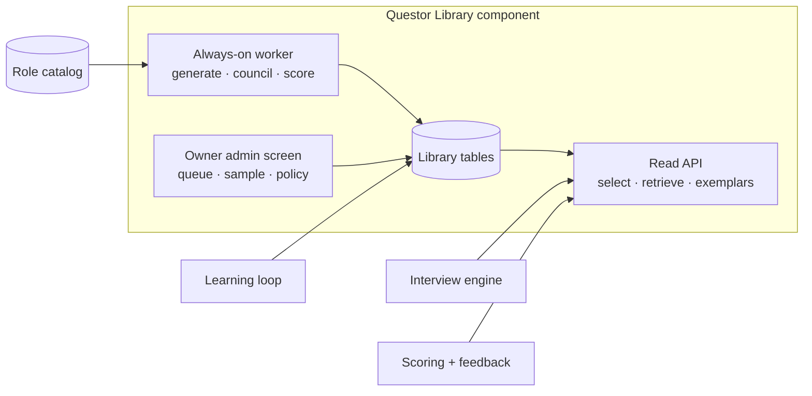
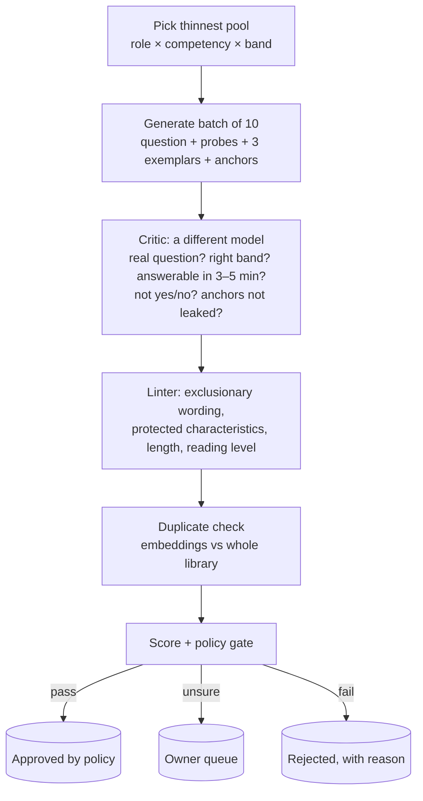

# Questor — Question & Answer Library Plan

2026-09-20 · Claude Doc: https://claude.ai/code/artifact/bb6318d6-ff6a-442a-989a-2d7db7911bc2

## Summary

Build the **Questor Question & Answer Library**: an independent, always-on component that holds, for every role, competency and experience level, a deep pool of approved interview questions **and** what strong, adequate and weak answers to each look like. Interviews draw from it; assessment and candidate feedback are anchored to it; it keeps improving itself on the VPS.

- **Questions and answers.** Each entry is a question with follow-up probes, phrasing variants, and answer exemplars at three levels. The exemplars are what make scoring consistent and the feedback letter specific.
- **Independent component.** Own tables, worker, admin screen and read API, deployed with Questor but developed and released on its own. The interview engine only reads from it.
- **Always on.** A worker on the VPS fills the thinnest pools first, runs every candidate question through a council in code (generate, critique, lint, de-duplicate, score), and switches to maintenance once every pool is at depth.
- **Owner in control without owner bottleneck.** Questions that pass the council are approved by policy; the owner sets the policy, reviews a daily sample and everything flagged, and can edit or retire anything. Organisation-added questions are private unless shared.
- **No two interviews the same.** Random selection within coverage rules, rotation across candidates, answer-driven follow-ups and CV-based personalisation. Comparability comes from shared competencies and anchors, not shared questions.
- **Rollout in shadow mode first:** the library runs alongside the current question bank and is compared before it takes over, organisation by organisation.

The local-model fallback is a separate track and is not a dependency of this plan.

## What the library holds

An entry is a structured record, attached to the role catalog, that carries both the question and what answers to it look like.

| Part | Contents |
| --- | --- |
| Attachment | Domain → job family → role (or “any role in this family”) × competency × experience band. One entry can serve several roles in a family. |
| Type | Warm-up · behavioural · situational · technical · work sample · candidate’s-turn prompt |
| Question | The wording as asked, plus 1–2 alternative phrasings |
| Probes | 2–3 follow-ups, each with the cue it answers (“plan described but no result → ask what changed”) |
| **Answer exemplars** | Three short model answers: **strong**, **adequate**, **weak** for this band, each with the one or two features that make it so. Never shown to candidates. |
| Anchors | What a strong answer covers and what a weak one misses, as checklist items the scorer and the feedback letter can cite |
| Difficulty | 1–3 within the band |
| Variants | Region and language versions of the wording; anchors and exemplars are shared |
| Provenance | Built-in · generated-and-passed · organisation-added (private or shared) · who approved, when, under which policy version |
| Quality signals | From the learning loop: evidence yield, non-answer rate, human-vs-AI agreement, times asked, last asked |

**Why the answers matter as much as the questions.** The exemplars give the assessor a fixed reference per question and band, so two candidates answering different questions on the same competency are judged against the same standard. They also let the feedback letter say precisely what a stronger answer would have included, in the words of that question’s own anchors rather than generic advice.

**Pool targets.** At least 12 entries per competency and band for every live role, 20+ for common roles, each with all three exemplars. Pools below target are served by the built-in bank until they reach it.

## Architecture: an independent component

The library is a module inside the Questor codebase with hard boundaries, so it can be built, tested, reviewed and released on its own and can never break a live interview.

| Piece | Detail |
| --- | --- |
| Tables | `LibraryEntry`, `LibraryProbe`, `LibraryExemplar`, `LibraryVariant`, `LibraryReview` (council results and owner decisions), `LibraryPolicy`, `LibraryUsage` (which candidate got which entry). Own migrations; nothing else in Questor writes to them. |
| Worker | One background job under the existing lease system: finds the thinnest pools, generates, runs the council, scores, saves after every batch, resumes after a deploy, respects per-run and rolling-monthly budgets. |
| Read API | `select(role, band, coverage, exclusions)` for planning, `probe(entry, answerText)` for follow-ups, `exemplars(entry)` for scoring and feedback. Read-only, tenant-aware (global plus that organisation’s private entries). |
| Admin | Owner screen: review queue, daily sample, flagged items, policy thresholds, pool health by role; organisation screen: their private entries on the role page, with the share tick. |
| Isolation | The engine falls back to the built-in bank if the read API errors or a pool is below target. Library deploys are additive migrations only. Feature flag per organisation. |
| Deploy | Ships with Questor through the same deploy script; the worker starts with the server and stops cleanly on drain. |

## The generation pipeline

The worker runs continuously on the VPS and only stops when every pool is at target; then it maintains.

**Sources the generator reads.** The role’s scorecard and competency definitions, the job description, the experience-band guidance, existing entries in the pool (to avoid overlap), and the built-in bank as style reference. Never candidate data.

**The council in code.** Generator and critic are different models so one cannot mark its own work: OpenAI GPT-5.6 Sol generates; the critic is a second model (an Anthropic model if a key is added, otherwise a second OpenAI model with a different prompt, or the local model once the fallback track lands). The linter is deterministic (the existing JD lint and policy-engine checks). Every verdict is stored with the entry, so the policy can be tuned and audited.

**Exemplar quality.** The critic also grades the three exemplars against the anchors and rejects the set if the “strong” answer is generic or the “weak” one is a caricature; exemplars must read like a real person answering at that level.

**Budgets and resumability.** Same controls as the catalog refresh: per-run and rolling-30-day caps on model calls, progress saved after every batch, a lease so two workers never overlap, clean stop on deploy and resume after. Generation uses the primary model; when it is unavailable the worker pauses and retries later rather than filling the library from a weaker source.

## Approval: policy first, owner sample second

At \~40k entries (family level) the owner cannot read every question. The catalog-refresh model — every proposal in a queue — would stall the library on day one. Proposed instead:

| Outcome of the pipeline | What happens |
| --- | --- |
| Critic pass + linter clean + not a duplicate + score ≥ threshold | **Approved by policy.** Usable at once, tagged `policy` so it can be pulled back. |
| Any check unsure (score in the grey band, near-duplicate, linter warning) | **Owner queue.** Shown with the critic’s reasons; approve / edit / reject. |
| Any check fails | **Rejected**, reason stored; the generator sees the reason on its next batch for that pool. |

**Daily owner sample.** Each morning the admin screen shows 20 policy-approved entries chosen at random (weighted to pools filled since yesterday) for a two-minute pass. A rejection in the sample lowers that pool’s threshold band automatically and pulls the entry from selection immediately.

**Private by default, opt-in sharing (owner decision).** Every organisation’s custom questions and their usage stay in the organisation. The global library is the platform-owned set. An organisation can share an entry into the global pool; it goes through the same critic + queue, and once shared it carries no organisation name.

**Editing and retiring.** An approved entry is never edited in place — editing creates a new version, the old one stops being selected but stays for transcript history. Retiring is a status change with a reason (poor evidence yield, owner sample, complaint, duplicate). Nothing is deleted.

**Audit.** Every status change is an audit event with actor (`policy`, owner, organisation user) and reason, on the existing audit log.

## How an interview uses the library

The interviewer engine stays the owner of the conversation; the library becomes where its questions come from.

1. **At plan time** (when the interview is created), the engine calls `select` with role, competencies, experience band, organisation, and the candidate id. The library returns one entry per competency, plus one spare each, chosen from the approved pool with variety rules applied (next section). The chosen ids are stored on the interview plan version, so the plan is fixed before the candidate joins and can be audited later.
2. **During the interview**, after each answer the engine asks for `probe`: given the entry and what the candidate just said, which of the entry’s follow-up probes fits. Probe choice is by embedding similarity between the answer and each probe’s “use when” note — no model call. The model only writes the conversational glue (acknowledgement, bridge, the probe in its own words), as it does today.
3. **At assessment time**, the evidence extractor receives the entry’s anchors and exemplars alongside the transcript, so “strong” is judged against what strong looks like for this question, not in the abstract. This is what makes the assessment consistent across candidates who got different questions.
4. **After the interview**, `usage` is recorded per entry: asked, answered or non-answer, evidence yield, and later the reviewer’s agreement (from `ReviewDifference`). That feeds the quality loop.

**What does not change.** The opening, consent, stop/postpone handling, pacing, the closing question and the time budget all stay in the engine. If the library is off or returns nothing for a pool, the engine falls back to the built-in bank exactly as today — the candidate never sees a difference.

**Custom questions.** An organisation’s own entries are selected first for its roles when they exist for that competency; the global pool fills the rest.

## Variety and fairness

The owner’s requirement: the same questions are not used for each candidate. Variety and fairness pull in opposite directions, so the rules are explicit.

**Variety rules (selection).**

- **No-repeat window:** an entry is not asked again for the same role in the same organisation within 30 days (proposed; decision 3), and never twice to the same candidate across interviews.
- **Least-recently-used first:** within a pool, entries are ordered by last-asked time, with a small random shuffle among the top five so two interviews created the same minute still differ.
- **Variants count as the same question** for repeat purposes — a rewording does not reset the window.
- **Pool depth** of 12 approved entries per pool is the minimum before variety is enforced; below that the engine uses what exists and the worker prioritises the pool.

**Fairness rules (equivalence).**

- Every entry in a pool is tagged with a difficulty band from the critic (1–3); a candidate gets the same band mix as every other candidate for that role, so variety never means one candidate had the hard set.
- All entries in a pool share the same anchors and exemplar levels, so assessment is comparable regardless of which entry was drawn.
- The linter rejects wording that assumes background (schooling, location, family, nationality), and entries are stored in plain language at a fixed reading level.
- HR can see which questions were asked (decision 4, proposed yes) so a reviewer can judge the answer against the actual question, and a candidate’s erasure request removes usage rows with the rest of their data.

**Measured, not assumed.** The quality loop compares evidence yield per entry across candidates; an entry that yields consistently less than its pool siblings is flagged as a fairness problem, not just a weak question.

## The quality loop, and what “super decent” means

Generation fills the library; usage decides what stays. Each entry accumulates:

| Signal | Source | Meaning |
| --- | --- | --- |
| Evidence yield | evidence extractor | how much scorable evidence the answer produced, per minute |
| Non-answer rate | policy engine | how often candidates could not or did not answer it |
| Probe rate | conversation runtime | how often a follow-up was needed before an answer had substance |
| Reviewer agreement | `ReviewDifference` | whether the human reviewer moved the score on this competency |
| Owner sample verdicts | admin screen | direct human quality judgement |

Every night the worker recomputes a **quality score** per entry from these, retires the bottom of each pool once it has enough uses (a minimum of 10 so one odd interview cannot retire a question), and asks the generator for replacements in that pool with the retired entry’s failure reason attached (“candidates answered this in one sentence”, “reviewers consistently scored higher than the AI here”). This is the Brahmastra method as a loop: generate, critique, use, measure, replace.

**Definition of done for “a super decent set”** — the worker reports against these on the admin screen and stops filling when all are met:

1. Every job family × competency × band pool has at least 12 approved entries (20+ for the top 50 roles by interview volume).
2. At least three difficulty bands present per pool.
3. The 30-day no-repeat rule can be satisfied for a role running 10 interviews a week.
4. Owner sample rejection rate under 5% over the last 200 sampled.
5. Median evidence yield of library entries at or above the built-in bank’s.
6. Reviewer agreement on library-driven interviews no worse than on built-in ones.

After that, maintenance: replacements for retired entries, new roles from the catalog, and re-lint when policy text changes.

## Rollout

The library ships behind a feature flag and is switched on per organisation, in the same way shadow mode was introduced.

1. **Build dark.** Tables, worker, admin screen and read API go to production with `LIBRARY_ENABLED=false`. The worker starts filling immediately; nothing touches an interview. The owner watches the admin screen and the daily sample.
2. **Shadow selection.** With the flag on but no organisation enabled, every new interview plan also records what the library *would* have selected. A report compares evidence yield and reviewer agreement between the built-in bank and the library’s shadow picks over two weeks, on real interviews, without changing any candidate’s experience.
3. **First organisation.** The owner’s demo sandbox goes first, then one real organisation that agrees. The engine now draws from the library for that organisation, with the built-in bank as automatic fallback on any error or empty pool.
4. **Default on** for new organisations once the shadow report holds for two weeks; existing organisations opt in from Hiring policy settings.
5. **Custom questions** open to organisations after default-on, with opt-in sharing into the global pool.

**Kill switch.** The flag can be turned off at any time; in-flight interviews keep the questions already in their plan, new plans use the built-in bank. No data migration is needed in either direction.

**Release discipline** as for every release: clean worktree, Codex gate, server and web suites, seed, e2e, migrations check, Postgres run, both branches pushed, deploy script, health check. The worker gets its own smoke test on the VPS (one batch end to end, then pause).

## Scale, cost and timeline

**Scale.** 492 roles × \~6 competencies × 5 bands × 12 entries ≈ 175k entries if generated per role. Grouping roles into \~120 job families (the catalog already carries domain and family) with role-specific variants where the competency actually differs brings the core set to \~43k entries, each with 3 probes and 3 exemplars. Recommended: family level first, role variants only for the top 50 roles by interview volume (decision 2).

**Cost.** One generated entry (question + probes + exemplars + anchors) costs roughly one generator call and one critic call, about 3–4k tokens together on GPT-5.6 Sol at low reasoning effort. The core 43k set is therefore on the order of 150–200M tokens across the two models, which with today’s pricing is in the low hundreds of dollars, spread over weeks under the daily budget cap. Embeddings and probe matching run locally and cost nothing per call. The library pays for itself in interview calls saved: with questions and probes pre-written, each interview turn needs a shorter, cheaper glue call, and the assessment gets its anchors for free.

**Throughput on the VPS.** The worker is I/O bound (API calls), not CPU bound; at a modest concurrency of 4 batches in flight it fills roughly 2–3k entries a day inside the daily cap, so the core set takes two to three weeks of always-on running, with the thinnest pools filled first so real roles are covered early.

**Timeline (build).**

| Phase | Content | Effort |
| --- | --- | --- |
| L0 | Tables, migrations, worker skeleton with lease and budgets, generate + critic + linter + dedupe, admin screen (pools, queue, sample), read API; deployed dark | 3 days |
| L1 | Engine integration: select at plan time, probe during interview, anchors at assessment, usage rows; shadow selection report | 2 days |
| L2 | Quality loop: nightly scoring, retire + replace, “super decent” dashboard; per-organisation switch in Hiring policy | 1–2 days |
| L3 | Custom questions and opt-in sharing | 1 day |

Each phase is released on its own with the usual gate. L0 starts the always-on filling, so the two-to-three-week fill runs while L1–L3 are built.

**The Ollama track runs in parallel or later** (owner decision): it is the fallback for the conversational glue when OpenAI is unavailable, and the library makes that fallback viable because a small local model only has to phrase, not invent. Nothing in L0–L3 depends on it.

## Decisions needed

Already decided: private by default with opt-in sharing; variety is a requirement; the library is an independent, always-on component on the VPS; Ollama in parallel or later; **questions are role-specific and experience-specific** (owner, 2026-09-20 evening: the interview must be meaningful for the actual role and flow like a real interview; the library is the layer of what can be asked, the interviewer voice makes it human).

1. **Approve-by-policy with a daily owner sample** (this doc) versus every entry through the owner queue (the catalog model). Recommendation: policy, because the queue would stall the library at tens of thousands of entries.
2. **Fill order for role-specific generation.** Every entry is generated from the role’s own scorecard and JD wording (no family-level sharing). To keep the cost and fill time in range, the worker fills **by demand**: a role’s pools go to full depth as soon as an organisation creates that role (or it is in the top 50 by volume); the long tail is kept at a lighter depth (6 per pool) until first use, then topped up. Recommendation: yes. (Replaces the earlier family-level proposal in “Scale, cost and timeline”.)
3. **No-repeat window: 30 days** per role per organisation, never twice to one candidate. Recommendation: yes; adjustable per organisation later.
4. **Pool depth: 12** approved entries before variety is enforced, 20+ for the top 50 roles, 6 for unused long-tail roles. Recommendation: yes.
5. **HR sees the questions asked** on the assessment (they already see the transcript, so this is a presentation choice). Recommendation: yes.
6. **Critic model:** add an Anthropic API key so the critic is a genuinely different model family, or use a second OpenAI model with a different prompt. Recommendation: Anthropic key if available; second OpenAI model otherwise.
7. **Start L0 now**, ahead of the queued rejoin and Phase 4 maintenance items, or after them. Recommendation: L0 first, because the fill takes weeks and only starts once L0 is deployed.
8. **Budget cap** for generation: a daily cap that keeps the fill of in-use roles at two to three weeks; the exact number is set in the environment and can be changed without a release.

OpenAI credits are required before L0 can fill anything; the build itself does not need them.

## Council review (2026-09-20)

Five members reviewed the plan above independently (Opus, Sonnet, Fable, agy, Codex; category architecture). Their verdict, in one line: **the direction is right, but as written the library would make the conversation more scripted, not less, and three of its numbers do not hold.** What follows is the synthesis; the sections above are left as originally written so the owner can see what changed and why.

### Where all five agreed

1. **Probe selection by embedding alone is the weakest idea in the plan.** A probe cue such as "plan described but no result" is a statement of *absence*; cosine similarity measures topical overlap, so an answer that never mentions a result still matches it. The engine would pick confidently and wrongly, and the glue call cannot repair a wrong probe. The candidate feels it at exactly the second and third turn on each competency — the moments the owner cares most about. **Change:** the codebase already computes the right signals deterministically (`answerQuality()` in `interviewDirector.ts` returns hasSituation / hasAction / hasResult / specific). Store each probe's cue as a predicate over those flags; when no predicate fires cleanly, or two tie, a small model call chooses between the library probes, *none*, or a fresh follow-up written from the answer. The library's probes are suggestions to the interviewer, never a lookup table.
2. **Shadow selection measures nothing.** Evidence yield and reviewer agreement are properties of questions that were *asked*; for shadow picks they are unobservable. **Change:** replace it with **within-interview interleaving** — half the competency blocks drawn from the library, half from the built-in bank, in the same interview. Same candidate, same day, same reviewer: a paired comparison that yields a real number in weeks, not a counterfactual.
3. **Approve-by-policy with a 20-a-day random sample is not a gate.** At the plan's own fill rate it audits under 1% of what shipped, after it has already been asked of real candidates. **Change:** staged promotion — `draft → approved-by-policy (probational) → live`. A probational entry is served only to the demo sandbox and to the interleaved trial; it goes live after N clean uses with acceptable evidence yield. New pools and new generator prompt versions start owner-queued and graduate to policy-approval after a clean sample. The daily sample is **stratified by pool and generator version**, not random.
4. **The cost, scale and throughput numbers are stale and optimistic.** Decision 2 adopted role-specific generation but the "Scale, cost" section still prices the 43k family set. Per accepted entry, with three exemplars that "read like a real person", a growing pool passed as context to avoid overlap, a critic that re-reads all of it, and retries, the honest estimate is 10–15k tokens, not 3–4k — a 5–10× miss. "2–3k entries a day" assumes ~40s per entry end to end; halve it. **Change:** recompute for the role-specific-by-demand model before committing to L0 ordering, and state the cap in *calls per day* as `catalogRefreshChunk` does.
5. **"Same difficulty mix" is the appearance of fairness.** Difficulty 1–3 is an uncalibrated model label at generation time. **Change:** use the critic's tag only for cold start; define difficulty empirically after 10+ uses (median evidence yield, non-answer rate), and measure comparability directly by cross-scoring a sample of real transcripts against sibling entries' anchors — if siblings disagree, the pool is not comparable whatever the labels say. Drop "same mix" from the fairness claims until it is measured.

### Defects found by one member and confirmed on reading

- **Pool depth 12 cannot satisfy a 30-day no-repeat window at 10 interviews a week** (~43 interviews in the window, one entry per pool each). Definition-of-done item 3 is arithmetically impossible as stated. Fix the depth formula (depth ≥ interviews expected in the window, per pool) or the window before L0.
- **The plan regresses the one variety mechanism that already works.** `conversationRuntime.ts` enforces variety by *question form* (`QuestionForm`, `NO_REPEAT_WINDOW`), with a comment recording the production incident it prevents (four consecutive "describe a situation where…" questions, after which the candidate asked to leave). The library's rules are all entity-level; twelve approved STAR questions satisfy every rule and reproduce that failure. **Change:** form distribution becomes a pool target and a DoD item, and `select` carries the form tag so the existing window keeps working.
- **Feeding exemplars to the grader re-creates a documented failure.** `evidenceExtractor.ts` explains why semantic attribution is disabled: attributor and grader are the same model answering nearly the same question, and the salted-transcript test went from CONSIDER/42% to PROCEED/100%. A "strong" exemplar invites surface pattern-matching. **Change:** score against anchors (checklists) first; exemplars only as tie-breakers; gate exemplar-anchored scoring behind the same salted-transcript regression test.
- **Plan-time selection under-provisions the director.** `directorDecide` grants up to three answers per block, a bonus turn for weak or strong answers, and `depthInstruction: 'decrease'` when someone is struggling; "one entry plus one spare" cannot serve that. **Change:** select a **ladder per block** (2–3 entries spanning difficulty) so an easier sibling exists at the moment the director asks for one.
- **Long-tail roles never reach 10 uses**, so the nightly retire-and-replace loop only ever runs for the top roles. Say so plainly, and add a pool-health trigger that does not depend on volume (owner sample, single-instance complaint, critic re-run on prompt change).
- **Organisation-added entries are untrusted text rendered into a model prompt and spoken aloud.** The current gate only fires on *sharing*. Lint and injection-screen at creation.
- **The VPS is shared with live interviews.** O(n) embedding dedupe against a growing library on 4 cores contradicts "can never break a live interview". Cap CPU, run dedupe off-peak, use an approximate index, and keep the worker at low process priority — or run it as a separate pm2 process that the deploy script can pause.
- **Nothing in the design lets the interviewer show it was listening.** Add a **callback turn**: one block whose question is built live from an earlier answer ("you mentioned the migration slipped a quarter — what would you do differently?"). It is the cheapest way to make the whole interview feel unscripted.
- **The summary promises CV-based personalisation but `select` never sees the CV.** Either pass CV signals into selection (with the existing evidence rules) or remove the promise.

### Where members disagreed — for the owner

| Question | Positions | Recommendation |
|---|---|---|
| Role-specific vs family-level generation | agy: revert to family level (cost, fill time). Fable: role-specific *questions* on demand, but pre-generate family-level *anchors and exemplars*, which are what scoring actually needs. Codex: family-level curated fallback for rare roles to avoid cold-start harm. | Keep the owner's decision (role-specific questions) and take Fable's split: anchors and exemplars at family level, questions per role. Rare roles use the family pool plus a JD-personalised question until their own pool is validated. |
| Data model | agy, Opus: one versioned JSON aggregate per entry (probes, exemplars, anchors are always read together). Codex: version everything that changes interpretation (role, competency, rubric, prompt, model, policy, locale). | Both: `LibraryEntry` holds the aggregate as a versioned JSON column with a `supersedes` chain, plus explicit version columns for competency, rubric, generator prompt, critic model and policy. `LibraryUsage` keyed to the interview, not the person, so erasure is clean. |
| Probe choice | Opus: deterministic predicates over answer signals. Fable, Codex, agy: a small reasoning call. | Predicates first, model call on ambiguity (agreement item 1). |
| Critic model (decision 6) | Opus, Fable: a second OpenAI model with a different prompt is not an independent critic. | Add the second model family, or raise the owner sample rate to compensate; do not describe same-family critique as adversarial. |

### What the council says the candidate would feel

The opening stays warm because the engine keeps it. Then, as written: one pre-chosen question per competency, a canned probe picked by lookup, move on. Today the model *writes* the follow-up; in the plan it only paraphrases one of three. The human moments in the current runtime — rephrase after a non-answer, re-ask after a pause, ease off when someone is struggling, answer the candidate's own question — have no library counterpart. **Net effect of the original design: more consistent scoring, a more scripted conversation.** The changes above (probes as suggestions, ladder per block, callback turn, form diversity) are what turn it back into an interview. The owner should confirm this trade explicitly: consistency is the library's gift; the conversation must stay the engine's.

### Revised scope for L0 (recommended)

Several members judged L0 over-scoped and its 3-day estimate 2–3× light (catalogRefresh alone is seven files). Ship L0 as **questions + anchors + form tag only** — no probes, no exemplars, no variants, no sharing — with staged promotion and the interleaved trial. Let the existing probe ladder handle follow-ups. Prove that it feels like an interview and that evidence yield holds; then add exemplars (behind the salted-transcript gate), then probes as suggestions, then custom questions. Revised effort: L0 5–6 days, L1 3 days, L2 2 days, L3 1–2 days.

### Decisions changed by the review

- Decision 1 (approval) → staged promotion with probational status and stratified sampling.
- Decision 2 (fill) → role-specific questions, family-level anchors/exemplars, rare-role fallback; cost and fill time to be recomputed before ordering.
- Decision 4 (pool depth) → depth is derived from expected interviews in the no-repeat window, not a fixed 12.
- Decision 6 (critic) → a second model family is required for the critic to count as independent.
- New: **form diversity** in pool targets and DoD; **callback turn** in every interview; **interleaved trial** replaces shadow selection; **DoD split** into structural criteria (can be met at fill) and outcome criteria (require real usage) so a pool cannot report "done" on structure alone.

Peer-review scoring between members was skipped for this session (fast mode, owner asked for the document first); the chair by score for architecture is Opus, and this synthesis was written by the session lead from all five reviews. Full member reviews are in `notebook/council/2026-09-20-qa-library-council.md`.
